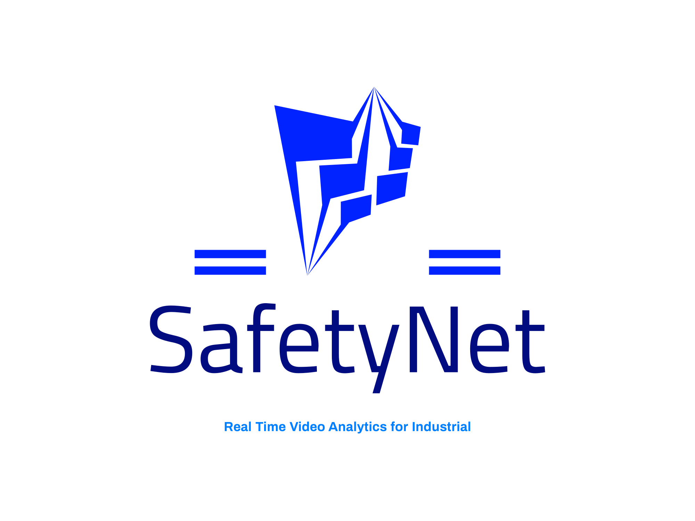

# SafetyNet
<div align="center">
  <p>
      
  </p>
</div>
Industrial Safety is essential for promoting worker safety, preventing accidents, ensuring compliance, and enhancing overall operational efficiency in industrial environments. This project aims to develop a real-time video analytics tool that enhances industrial safety by detecting and preventing potential hazards and unsafe situations in industrial environments.

## Video Demo

[](https://youtu.be/g59md8sZycY)

## Objective

The objective of this project is to leverage Deep Learning techniques to monitor live video feeds and provide real-time hazard detection, prompt alerts, and interventions, enhancing industrial safety and preventing accidents in industrial environments.

## Project Structure & Flow


## Technologies & Tools

- Python
- OpenCV
- Tensorflow
- YOLO (You Only Look Once) v8
- Flask (APIs and Back-end)
- React (Web-Application / Front-end
- Firebase - Firestore (NoSQL Database)
- RaspberryPi (Sensor Integration)

## Features

- Real-time video analysis for hazard detection.
- Proactive alert system for immediate intervention.
- User-friendly web interface for monitoring and control.
- Integration with existing industrial video data.
- Dashboard for factory managers to track safety statistics and incidents.

## Getting Started

Follow these steps to get started with the project:

1. Clone this repository to your local machine:

   ```bash
   git clone (https://github.com/smartinternz02/SBSPS-Challenge-10024-SafeZone-Real-time-Video-Analytics-for-Industrial-Safety)https://github.com/smartinternz02/SBSPS-Challenge-10024-SafeZone-Real-time-Video-Analytics-for-Industrial-Safety)
   cd SBSPS-Challenge-10024-SafeZone-Real-time-Video-Analytics-for-Industrial-Safety
   ```
2.  Install the required dependencies:

    ```bash
    pip install -r requirements.txt
    ```

3. Start the application:

   ```bash
   cd flask_api
   python app.py
     ```
   
5. Run web application:

     ```bash
     cd frontend
     npm i -S react-scripts
     npm start
     ```
6. Default - Test Credentials for the application
   ```
   admin@support.com / 123456
   manager@support.com / 123456
   ```
## Model statistics
### 1. Class labels:
    [Hardhat, Mask, NO-Hardhat, NO-Mask, NO-Safety Vest, Person, Safety Cone,
    Safety Vest, machinery, vehicle]
The model that was used in order to train this model was the **yolov8l** model that consists of 268 layers and 43,668,288 parameters. The model needs approximately 165 GFLOPS of compute power to run.
The model was trained on a custom dataset with the aforementioned classes and the hardware that was required to train that model was: **2x Nvidia Tesla T4 GPUs with 16gb VRAM each, 30GB of RAM and 4v CPU compute Engine.**

The model was trained for **310 epochs** and took a total amount of time of nearly **36 hrs** to train completely.
### 2. Model Metrics:
#### a. mAP50 (B): 
The mAP50 B is the Mean Absolute Precision where it measures the Average Precision of detections that have at least a 50% overlap with ground truth objects while excluding those overlapping with the background.

#### b. mAP_0.5: 
The mAP_0.5 is the same as the previous one but in contrast, mAP_0.5 calculates Average Precision based on detections with an Intersection over Union (IoU) of 0.5 or higher with ground truth objects.

#### c. Precision:
Precision in object detection is a metric that assesses the accuracy of a model's detections. It measures the ratio of correctly predicted positive detections to the total number of positive predictions made by the model. In the context of object detection, a "positive detection" refers to a bounding box or region proposed by the model that correctly corresponds to an actual object in the scene.

#### d. Recall:
Recall, in the context of object detection, is another important metric that evaluates the completeness of a model's detections. It measures the ratio of correctly predicted positive detections to the total number of actual positive objects present in the scene.

## Usage
- Upload industrial video data for analysis.
- The system will analyze the video in real-time, detecting potential hazards.
- The dashboard provides real-time statistics on safety incidents.
- When a hazard is detected, the system triggers alerts and interventions as needed.

## Outputs
### 1. Safety Gear Recognition: 


### 2. Emergency Hand Gesture Detection:


## Implementation Screenshots
### Introduction


## Login for Admins & Managers


## Admin Dashboard
<p>
  It consists of Organization wide data, i.e. data collected from all the factories / industrial sites are crunched together for the admin of the organization to observe.
</p>


<p>
The admin dashboard also has access to analytics and stats related to the safety of the industrial sites, the graphs of safety-scores, fire-incidents and harmful gas sensor alerts
</p>


## Manager Dashboard

<p>
  It consists of Factory / Industrial area wide data, i.e. data collected from that particular factory or industrial site is crunched together for the manager of the respective site to observe.
</p>


<p>
The manager dashboard also has access to analytics and stats related to the safety of the industrial sites, the graphs of safety-scores, fire-incidents and harmful gas sensor alerts
</p>


